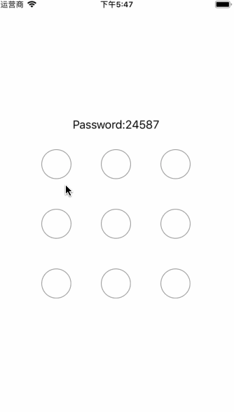

# react-native-simple-gesture-password

A **simple** gesture password for react-native apps. It only draws gesture passwords, don'nt do any additional operations. You can put it anywhere you want, it can resize itself according to the parent.

<div align=center></div>

## Install 

```bash
$ yarn add react-native-simple-gesture-password
```

## Usage

```js
import React, { Component } from 'react'
import { StyleSheet, View, Text } from 'react-native'

import GesturePassword from 'react-native-simple-gesture-password'

export default class App extends Component {
  state = {
    value: ''
  }

  render() {
    return (
      <View style={styles.container}>
        <Text style={styles.password}>Password:{this.state.value || 'null'}</Text>
        <View style={styles.wrapper}>
          <GesturePassword onChange={value => this.setState({ value })} />
        </View>
      </View>
    )
  }
}

const styles = StyleSheet.create({
  container: {
    flex: 1,
    justifyContent: 'center'
  },
  password: {
    fontSize: 18,
    textAlign: 'center',
    marginBottom: 20
  },
  wrapper: {
    height: 250
  }
})

```